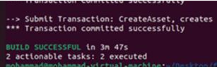

**Attack** **Implementation** **Description**

**Batch** **Timeout** **Attack**

To simulate a batch timeout attack on a Hyperledger Fabric network, we
utilized kingworm-network and Hyperledger Fabric sample scripts,
designed to automate network deployment and configuration and dependent
on Docker and the Hyperledger Fabric binaries. These scripts facilitated
the creation of a Hyperledger Fabric network consisting of five Raft
ordering service nodes and two organizations, each with multiple peer
nodes, all participating in a single channel. To execute the analysis,
we modified the channel configuration by adjusting the
orderer.BatchTimeout parameter within the configtx.yaml file. This
parameter controls the maximum time to collect a transaction batch.
After updating the configtx.yaml, we used the provided scripts to
rebuild the network with the modified channel configuration. To assess
the impact of the batch timeout manipulation, we deployed a Java-based
client application, application \#1, associated with a user in
Organization 1. This application was designed to submit a high volume of
transactions to the channel (See below Function). We implemented a loop
within the application's createAsset function to generate and submit
transactions concurrently. The createAsset function invoked the
appropriate chaincode functions to record transactions on the ledger. We
then measured the application's runtime using System.currentTimeMillis()
in Java to determine the time required for transaction commit
confirmations for different batch timeout values. We also monitored the
application's terminal output for successful transaction confirmations,
indicating the attack's effect on transaction processing time. You can
see a sample Application output time in the image below.




```java
private void createAsset(String assetId, String color, String size,
String owner, String appraisedValue) throws EndorseException,
SubmitException, CommitStatusException, CommitException {

    System.out.println("\n--> Submit Transaction: CreateAsset");
    for (int i = 0; i < 1000; i++) {

        contract.submitTransaction("CreateAsset", String.valueOf(i),
        String.valueOf(i), String.valueOf(i), String.valueOf(i),
        String.valueOf(i));

        System.out.println("*** Transaction committed successfully");
    }

}

**Block** **discard** **attack**

To simulate a block discard attack on the Hyperledger Fabric ordering
service, I first modified the orderer.yaml file. Specifically, I reduced
the General: Cluster: SendBufferSize parameter for selected orderer
nodes, effectively limiting their ability to process large transactions.
Subsequently, using a client application built with the Hyperledger
Fabric SDK for Java, I implemented a script to generate transaction
proposals with varying payload sizes. The script employed a random
number generator to create payloads that would exceed the reduced
SendBufferSize of the targeted orderers. When these oversized
transactions were submitted to the ordering service, the undersized
orderers were unable to process them, leading to transaction proposal
rejections and timeouts. These data are sent to the system based on a
random function with different probability rates. This resulted in the
ordering service failing to include these transactions in blocks,
effectively discarding them. The aim was to disrupt the ordering
service's ability to create consistent blocks across the network,
potentially leading to inconsistencies in the ledger state. I monitored
the application runtime using System.currentTimeMillis() and observed
the rate of transaction commit confirmations to quantify the attack's
impact. I also examined the ordering service logs for messages
indicating transaction rejections and timeouts, confirming the block
discard behavior. The used command was “docker logs -f \<orderer
container_id_or_name\>”

```java
import java.util.Random;

private void createAsset(String assetId, String color, String size, String owner, String appraisedValue, int maxPayloadSize, Contract contract)
    throws EndorseException, SubmitException, CommitStatusException, CommitException {
    System.out.println("\n--> Submit Transaction: CreateAsset");
    Random random = new Random();
    int payloadSize = random.nextInt(maxPayloadSize + 1);
    String payload = generateRandomString(payloadSize);
    int iterations = 100;
    int authorizedOnes = 5;
    int counter = 0;

    for (int i = 0; i < iterations; i++) {
        if (generateRandomBinary(authorizedOnes, iterations) == 1 && counter < authorizedOnes) {
            System.out.println("Submitting large payload transaction, payloadSize: " + payloadSize);
            contract.submitTransaction("CreateAsset", String.valueOf(i), String.valueOf(i), String.valueOf(i),
                String.valueOf(i), payload);
            counter++;
        } else {
            System.out.println("Submitting small payload transaction");
            contract.submitTransaction("CreateAsset", String.valueOf(i), String.valueOf(i), String.valueOf(i),
                String.valueOf(i), String.valueOf(i));
        }
    }
}

private String generateRandomString(int length) {
    String characters = "ABCDEFGHIJKLMNOPQRSTUVWXYZabcdefghijklmnopqrstuvwxyz0123456789";
    StringBuilder result = new StringBuilder(length);
    Random random = new Random();

    for (int i = 0; i < length; i++) {
        result.append(characters.charAt(random.nextInt(characters.length())));
    }

    return result.toString();
}

private int generateRandomBinary(int authorizedOnes, int totalReps) {
    Random random = new Random();

    if (random.nextInt(totalReps) < authorizedOnes) {
        return 1;
    } else {
        return 0;
    }
}

**Bycott** **Attack**

To simulate an attack targeting the Hyperledger Fabric Membership
Service Provider (MSP), I focused on manipulating certificate
revocation. Specifically, I aimed to disrupt user authentication by
revoking a valid user's certificate and propagating this revocation to
the channel configuration. To achieve this, I modified the MSP
configuration to include the target user's certificate serial number in
the Certificate Revocation List (CRL). This modification was performed
on the local MSP configuration files. Subsequently, I generated a
configuration update transaction that included the updated CRL and
submitted it to the ordering service for a channel configuration update.
This effectively published the revoked certificate information to the
channel's configuration block. To test the attack's impact, I attempted
to perform transactions using the revoked user's credentials. The
expected outcome was that these transactions would be rejected by peers
due to failed certificate validation against the updated CRL. In a
legitimate network scenario, adding a user's certificate involves
creating a new identity and properly adding it to the MSP configuration,
not altering the CRL. This attack demonstrates how improper MSP
management or malicious modification of the CRL can compromise network
security. The default Hyperledger fabric java application is used for
this attack.

**Collusion** **Attack**

To implement this attack, I first modified the orderer.yaml
configuration files of the Hyperledger Fabric ordering service nodes.
Specifically, I reduced the General: Cluster: SendBufferSize parameter
for three Raft orderers from its default value to a significantly lower
value for malicious nodes. This reduction

aimed to prevent these orderers from processing transactions exceeding
the new buffer capacity, effectively disrupting the consensus mechanism.
Subsequently, using a client application built with the Hyperledger
Fabric SDK, I generated transaction proposals with payloads exceeding
the reduced SendBufferSize. These oversized transactions were created
with a specific probability distribution to simulate a realistic burst
of large transactions. The createasset function within the SDK
application was modified to generate payloads filled with huge data and
normal-size transactions based on a defined probability. The size of the
payload is controlled by a random number generator, y. This forced the
undersized orderers (malicious in the attack) to drop these large
transaction proposals during the consensus process, leading to proposal
rejections and timeouts. While orderers with the default SendBufferSize
were able to process smaller transactions, the influx of oversized
transactions and the resulting failures of the undersized orderers
disrupted the overall consensus process, causing delays and, ultimately,
a failure of the ordering service to commit blocks.

import java.util.Random;

private void createAsset(String assetId, String color, String size, String owner, String appraisedValue, int maxPayloadSize, Contract contract)
    throws EndorseException, SubmitException, CommitStatusException, CommitException {
    System.out.println("\n--> Submit Transaction: CreateAsset");
    Random random = new Random();
    int payloadSize = random.nextInt(maxPayloadSize + 1);
    String payload = generateRandomString(payloadSize);
    int iterations = 100;
    int authorizedOnes = 5;
    int counter = 0;

    for (int i = 0; i < iterations; i++) {
        if (generateRandomBinary(authorizedOnes, iterations) == 1 && counter < authorizedOnes) {
            System.out.println("Submitting large payload transaction, payloadSize: " + payloadSize);
            contract.submitTransaction("CreateAsset", String.valueOf(i), String.valueOf(i), String.valueOf(i),
                String.valueOf(i), payload);
            counter++;
        } else {
            System.out.println("Submitting small payload transaction");
            contract.submitTransaction("CreateAsset", String.valueOf(i), String.valueOf(i), String.valueOf(i),
                String.valueOf(i), String.valueOf(i));
        }
    }
}

private String generateRandomString(int length) {
    String characters = "ABCDEFGHIJKLMNOPQRSTUVWXYZabcdefghijklmnopqrstuvwxyz0123456789";
    StringBuilder result = new StringBuilder(length);
    Random random = new Random();

    for (int i = 0; i < length; i++) {
        result.append(characters.charAt(random.nextInt(characters.length())));
    }

    return result.toString();
}

private int generateRandomBinary(int authorizedOnes, int totalReps) {
    Random random = new Random();

    if (random.nextInt(totalReps) < authorizedOnes) {
        return 1;
    } else {
        return 0;
    }
}

**Malicious** **Client** **Attack**

To simulate a Denial-of-Service (DoS) attack targeting the Hyperledger
Fabric Raft ordering service, I modified the channel configuration by
updating the configtx.yaml file. Specifically, I reduced the
orderer.BatchSize.MaxMessageCount and orderer.BatchSize.AbsoluteMaxBytes
parameters effectively limit the maximum size of transaction batches the
orderer could process. Additionally, I directly adjusted the General:
Cluster: SendBufferSize within the orderer.yaml file to 10MB for the
five orderer nodes. This aimed to induce memory pressure and constrain
the ordering service's transaction processing capacity. I deployed

client applications, leveraging the Hyperledger Fabric SDK for Java,
each configured to interact with the Fabric network. Two applications
were associated with peers from Organization 1, and one with a peer from
Organization 2, each authenticated with unique Fabric user certificates.
Within these applications, a looped create asset function was
implemented. This function generated transaction proposals with long
data (not for overflowing). These transactions were submitted
concurrently to the ordering service using the SDK's
sendTransactionProposal and sendTransaction APIs. I monitored the
application's runtime using System.currentTimeMillis() in Java to
measure the time required for transaction commit confirmations from the
ordering service. A significant increase in the application's runtime
confirmed the successful DoS attack on the Hyperledger Fabric ordering
service.

import java.util.Random;

private void createAsset(String assetId, String color, String size, String owner, String appraisedValue, int maxPayloadSize, Contract contract)
    throws EndorseException, SubmitException, CommitStatusException, CommitException {
    System.out.println("\n--> Submit Transaction: CreateAsset");
    Random random = new Random();
    int payloadSize = random.nextInt(maxPayloadSize - 1); // Using maxPayloadSize parameter
    String payload = generateRandomString(payloadSize);
    int iterations = 1000;

    for (int i = 0; i < iterations; i++) {
        System.out.println("Submitting large payload transaction, payloadSize: " + payloadSize);
        contract.submitTransaction("CreateAsset", String.valueOf(i), String.valueOf(i), String.valueOf(i),
            String.valueOf(i), payload);
    }
}

private String generateRandomString(int length) {
    String characters = "ABCDEFGHIJKLMNOPQRSTUVWXYZabcdefghijklmnopqrstuvwxyz0123456789";
    StringBuilder result = new StringBuilder(length);
    Random random = new Random();

    for (int i = 0; i < length; i++) {
        result.append(characters.charAt(random.nextInt(characters.length())));
    }

    return result.toString();
}

**Raft** **Consensus** **Protocol** **attack**

To simulate an attack on the Raft ordering service's consensus
mechanism, I targeted the tick-interval parameter within the
orderer.yaml file. Specifically, I significantly increased this value.
The tick-interval dictates the frequency at which Raft nodes perform
leader elections and heartbeats. By extending this interval, I aimed to
disrupt the leader election process and cause timeouts within the Raft
cluster. After modifying the orderer.yaml and restarting the orderer
nodes to apply the changes, I updated the channel configuration.
Subsequently, using a client application built with the Hyperledger
Fabric SDK for Java, I initiated a high volume of transaction
submissions to the ordering service. I then measured the application's
runtime using System.currentTimeMillis() to determine the time taken for
transaction commit confirmations. To observe the impact on the consensus
process, I examined the orderer container logs, specifically searching
for log entries related to leader elections (leader changed), timeouts
(timed out), and follower state transitions (became follower). I also
searched for Raft proposal messages to track the number of attempted
consensus rounds. The presence of frequent leader changes, timeouts, and
a significant increase in the number of consensus rounds, coupled with
increased transaction latency, indicated a successful disruption of the
Raft consensus protocol. The application code has some changes in the
createAsset function.

private void createAsset(String assetId, String color, String size, String owner, String appraisedValue)
    throws EndorseException, SubmitException, CommitStatusException, CommitException {
    System.out.println("\n--> Submit Transaction: CreateAsset");
    for (int i = 0; i < 1000; i++) {
        contract.submitTransaction("CreateAsset", String.valueOf(i), String.valueOf(i), String.valueOf(i),
            String.valueOf(i), String.valueOf(i));
        System.out.println("*** Transaction committed successfully");
    }
}
